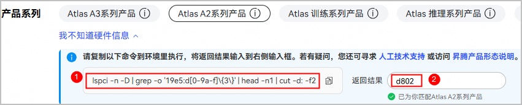

# 快速入门：基于ops-blas仓

## 使用须知

本指南旨在帮助您快速上手CANN和`ops-blas`算子仓的使用。为方便快速了解算子开发全流程，将以**scopy**算子为实践对象，算子源码按芯片架构区分目录（A2/A3 平台对应 `arch22/`，Ascend 950 PR/DT 对应 `arch35/`），以下以 A2/A3 硬件平台为例，其源文件位于`ops-blas/blas/copy/arch22/`，具体操作流程如下：

1. **[环境部署](zh/install/quick_install.md)**：完成软件包安装和源码下载，此处不再赘述。快速入门场景下，**推荐WebIDE或Docker环境**，安装操作简单。

   > **说明**：当前WebIDE或Docker环境默认最新商发版CANN包；如需体验master分支最新能力，可手动安装CANN包，注意软件与源码版本配套。

2. **[编译运行](#一编译运行)**：编译自定义算子包并安装，实现快速调用算子。

3. **[算子开发](#二算子开发)**：通过修改现有算子Kernel，体验开发、编译、验证的完整闭环。

4. **[算子调试](#三算子调试)**：掌握算子打印和性能采集方法。

## 一、编译运行

本阶段目的是**快速体验项目标准流程**，验证环境能否成功进行算子源码编译、打包、安装和运行。

### 1. 编译scopy算子

环境准备好后（注意软件与源码版本配套），进入环境并访问项目源码根目录，编译指定算子。

通用编译命令格式：`bash build.sh --pkg --soc=<芯片版本> --ops=<算子名>`。以scopy算子为例，编译命令如下：

```bash
bash build.sh --pkg --soc=${soc_version} --ops=scopy
```

${soc_version}设置方法如下：

访问[CANN下载中心](https://www.hiascend.com/cann/download)，根据页面提示复制硬件查询命令，在当前环境中执行，返回芯片ID信息，再回填到官网按Enter键获取产品名，产品名对应的${soc_version}取值如下，请按实际场景传参。

- Atlas A2 训练系列产品/Atlas A2 推理系列产品：取值为ascend910b
- Atlas A3 训练系列产品/Atlas A3 推理系列产品：取值为ascend910_93
- 950系列产品：取值为ascend950



若提示如下信息，说明编译成功。
```bash
Self-extractable archive "cann-ops-blas_${cann_version}_linux-${arch}.run" successfully created.
```
编译成功后，run包存放于项目根目录的build_out目录下。

### 2. 安装scopy算子包

> **说明**：run包必须通过`--install`参数执行安装，不带参数仅显示帮助信息不会安装。可通过`--install-path=<路径>`指定安装目录，默认安装路径：root用户为`/usr/local/Ascend`，普通用户为`~/Ascend`。
```bash
./build_out/cann-${soc_name}-ops-blas_${version}_linux-${arch}.run --install --quiet
```

### 3. 快速验证：运行算子样例

通用的运行命令格式：`bash build.sh --soc=${soc_version} --ops=<算子名> --run`。

以scopy算子为例，其提供了简单算子样例`test/copy/scopy/arch22/scopy_test.cpp`，运行该样例验证算子功能是否正常。

```bash
bash build.sh --pkg --soc=${soc_version} --ops=scopy --run
```
预期输出：打印算子`scopy`的计算结果，表明算子已成功部署并正确执行。

```
Running scopy_test...
Output: 1.2 1.2 1.2 1.2 1.2 1.2 1.2 1.2 ...
Golden: 1.2 1.2 1.2 1.2 1.2 1.2 1.2 1.2 ...
[Success] Case accuracy is verification passed.
```

> **提示**：若已完成编译且仅需重新验证功能，可直接运行已编译的二进制文件，无需再次编译。编译完成后，测试二进制文件位于`build/test/<家族>/<算子名>/<算子名>_test`，例如scopy算子的测试文件为`build/test/copy/scopy/scopy_test`，直接执行即可：
>
> ```bash
> ./build/test/copy/scopy/scopy_test
> ```

## 二、算子开发

本阶段目的是对已成功运行的scopy算子尝试**修改核函数代码**。

### 1. 修改Kernel实现
找到scopy算子的核心kernel实现文件`blas/copy/arch22/scopy_kernel.cpp`，尝试修改算子中的DataCopy操作：

```cpp
template <typename T>
__aicore__ inline void CopyAIV<T>::SingleIteration(uint32_t curOffset, uint32_t dataCount)
{
    LocalTensor<T> inLocal = inQueue.AllocTensor<T>();
    DataCopy(inLocal, inGM[curOffset], dataCount);
    inQueue.EnQue<T>(inLocal);
    int32_t eventIDMTE2ToMTE3 = static_cast<int32_t>(GetTPipePtr()->FetchEventID(AscendC::HardEvent::MTE2_MTE3));
    AscendC::SetFlag<AscendC::HardEvent::MTE2_MTE3>(eventIDMTE2ToMTE3);
    AscendC::WaitFlag<AscendC::HardEvent::MTE2_MTE3>(eventIDMTE2ToMTE3);
    LocalTensor<T> outLocal = inQueue.DeQue<T>();
    // DataCopy(outGM[curOffset], outLocal, dataCount);
    // 补充相应的AIV计算操作
    inQueue.FreeTensor(outLocal);
    int32_t eventIDMTE3ToMTE2 = static_cast<int32_t>(GetTPipePtr()->FetchEventID(AscendC::HardEvent::MTE3_MTE2));
    AscendC::SetFlag<AscendC::HardEvent::MTE3_MTE2>(eventIDMTE3ToMTE2);
    AscendC::WaitFlag<AscendC::HardEvent::MTE3_MTE2>(eventIDMTE3ToMTE2);
}
```

### 2. 编译与验证

重复[编译运行](#一编译运行)章节中的步骤：

1. **重新编译**：
    先回到项目根目录，编译命令如下：

    ```bash
    bash build.sh --pkg --soc=${soc_version} --ops=scopy
    ```

2. **重新安装**：
    ```bash
    ./build_out/cann-*-ops-blas_*.run --install --quiet
    ```

3. **重新验证**：
    ```bash
    bash build.sh --soc=${soc_version} --ops=scopy --run
    ```

4. **成功标志**：输出结果精度比对成功。
    ```
    Running scopy_test...
    Output: 1.2 1.2 1.2 1.2 1.2 1.2 1.2 1.2 ...
    Golden: 1.2 1.2 1.2 1.2 1.2 1.2 1.2 1.2 ...
    [Success] Case accuracy is verification passed.
    ```

## 三、算子调试
本阶段以scopy算子为例，在算子中添加打印并采集算子性能数据，以便后续问题分析定位。

### 1. 打印
算子如果出现执行失败、精度异常等问题，添加打印进行问题分析和定位。

请在`blas/copy/arch22/scopy_kernel.cpp`中进行代码修改。

* **printf**

  该接口支持打印Scalar类型数据，如整数、字符型、布尔型等，详细介绍请参见[《Ascend C API》](https://hiascend.com/document/redirect/CannCommunityAscendCApi)中“算子调测API > printf”。

  ```cpp
  blockLength_ = (tilingData->totalLength + AscendC::GetBlockNum() - 1) / AscendC::GetBlockNum();
  tileNum_ = tilingData->tileNum;
  tileLength_ = ((blockLength_ + tileNum_ - 1) / tileNum_ / BUFFER_NUM) ?
        ((blockLength_ + tileNum_ - 1) / tileNum_ / BUFFER_NUM) : 1;
  // 打印当前核计算Block长度
  AscendC::PRINTF("Tiling blockLength is %llu\n", blockLength_);
  ```
* **DumpTensor**

  该接口支持Dump指定Tensor的内容，同时支持打印自定义附加信息，比如当前行号等，详细介绍请参见[《Ascend C API》](https://hiascend.com/document/redirect/CannCommunityAscendCApi)中“算子调测API > DumpTensor”。

  ```cpp
  AscendC::LocalTensor<T> zLocal = outputQueueZ.DeQue<T>();
  // 打印zLocal Tensor信息
  DumpTensor(zLocal, 0, 128);
  ```
### 2. 性能采集

当算子功能验证正确后，可通过`msprof`工具采集算子性能数据。

-  **生成可执行文件**

    调用scopy算子的test样例，生成可执行文件（scopy_test），该文件位于项目`ops-blas/build/test/copy/scopy`目录。
    ```bash
    bash build.sh --soc=${soc_version} --ops=scopy
    ```

-  **采集性能数据**

    进入scopy算子可执行文件目录`ops-blas/build/test/copy/scopy`，执行如下命令：

    ```bash
    msprof --application="./scopy_test"
    ```
采集结果在项目`ops-blas/build/test/copy/scopy`目录，msprof命令执行完后会自动解析并导出性能数据结果文件，详细内容请参见[msprof](https://www.hiascend.com/document/detail/zh/mindstudio/82RC1/T&ITools/Profiling/atlasprofiling_16_0110.html#ZH-CN_TOPIC_0000002504160251)。
